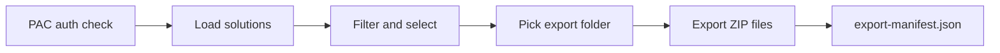

# PAC Solution Exporter


A small self-hosted web app for exporting selected Microsoft Power Platform solutions with the Power Platform CLI. It gives makers and admins a simple browser UI for listing solutions, filtering them, selecting multiple rows, and exporting solution ZIPs locally.

The app only lists and exports. It does not import, publish, delete, add components, or modify Dataverse assets.

## What It Looks Like



## Features

- Startup PAC authentication check with signed-in user badge.
- Sign-in button when no PAC auth profile is found.
- Solution table with checkboxes, select all, filters, search, type, last updated time, and updated by.
- Managed, unmanaged, and system/reference filters.
- Local Windows folder picker plus manual export path entry.
- Live export log and manifest file.
- Built-in setup guide at `/setup`.
- Windows launcher and desktop shortcut helper.

## Easiest Setup For First-Time Users

1. Open the repo page in GitHub.
2. Click **Code** > **Download ZIP**.
3. Extract the ZIP into a normal folder, for example:

   ```text
   C:\Tools\pac-solution-exporter
   ```

4. Open **Windows PowerShell ISE** or **Windows PowerShell**.
5. Go to the extracted folder:

   ```powershell
   cd "C:\Tools\pac-solution-exporter"
   ```

6. Run this setup block:

```powershell
Set-ExecutionPolicy -Scope CurrentUser RemoteSigned
.\scripts\Install-Prerequisites.ps1 -InstallMissing
.\scripts\Create-Desktop-Shortcut.ps1
.\Start-PAC-Solution-Exporter.cmd
```

7. The app opens in your browser:

```text
http://127.0.0.1:4141
```

After this, use the **PAC Solution Exporter** desktop shortcut.

Closing the browser tab does not stop the local server. When you are done, stop it with:

```powershell
.\Stop-PAC-Solution-Exporter.cmd
```

For the visual setup guide inside the app:

```text
http://127.0.0.1:4141/setup
```

## Developer Start

If Node.js and PAC CLI are already installed:

```powershell
npm start
```

If port `4141` is busy:

```powershell
$env:PORT='4142'; npm start
```

## Requirements

| Component | Why it is needed | Install |
| --- | --- | --- |
| Node.js LTS | Runs the local web server | `winget install -e --id OpenJS.NodeJS.LTS` |
| Power Platform CLI | Runs `pac` list/export/auth commands | Windows MSI from `https://aka.ms/PowerAppsCLI` |
| Power Platform access | Reads and exports solutions from your environment | Use an account with solution export permission |

Manual install commands:

```powershell
winget install -e --id OpenJS.NodeJS.LTS
Invoke-WebRequest https://aka.ms/PowerAppsCLI -OutFile "$env:TEMP\powerapps-cli.msi"
msiexec.exe /i "$env:TEMP\powerapps-cli.msi" /passive
```

Verify:

```powershell
node -v
npm -v
pac
```

## First Sign-In

Use the app's **Sign in** button, or run:

```powershell
pac auth create --environment "<environment-url-or-id>"
pac auth list
```

After sign-in, reload the app. The top-right badge should show the signed-in PAC user.

## Daily Use

1. Double-click the **PAC Solution Exporter** desktop shortcut, or run:

   ```powershell
   .\Start-PAC-Solution-Exporter.cmd
   ```

2. Enter an environment URL or ID, or leave it blank to use the active PAC environment.
3. Click **Load solutions**.
4. Select the solutions to export.
5. Choose an export folder.
6. Click **Export selected**.

The app writes ZIP files and an `export-manifest.json` file into the selected export folder.

When finished, close the browser and run:

```powershell
.\Stop-PAC-Solution-Exporter.cmd
```

The stop script only stops a Node.js process listening on the app port. If another program owns that port, it warns and leaves it running.

## Commands Used

```powershell
pac auth list
pac auth create --environment <environment-url-or-id>
pac solution list --environment <environment-url-or-id>
pac org fetch --environment <environment-url-or-id> --xml <solution-metadata-fetchxml>
pac solution export --environment <environment-url-or-id> --name <solution-unique-name> --path <zip-path> --overwrite
```

## Project Files

| File | Purpose |
| --- | --- |
| `server.js` | Local HTTP server, PAC wrapper, and browser UI |
| `package.json` | Start and syntax-check scripts |
| `Start-PAC-Solution-Exporter.cmd` | Double-click launcher for Windows |
| `Stop-PAC-Solution-Exporter.cmd` | Stops the local Node.js server |
| `scripts/Install-Prerequisites.ps1` | Checks or installs Node.js LTS and Power Platform CLI |
| `scripts/Start-PAC-Solution-Exporter.ps1` | Starts the server and opens the browser |
| `scripts/Stop-PAC-Solution-Exporter.ps1` | Finds and stops the app server by port |
| `scripts/Create-Desktop-Shortcut.ps1` | Creates a desktop shortcut |
| `exports/` | Default export output folder |

## Safety Notes

- Keep exported solution ZIPs out of source control.
- Do not commit `.env`, logs, auth output, or exported packages.
- Review custom connector definitions before publishing a solution ZIP to a public repository.
- This app is intended to run locally on a trusted admin or maker workstation.

## Official References

- [Node.js downloads](https://nodejs.org/en/download)
- [Power Platform CLI overview](https://learn.microsoft.com/power-platform/developer/cli/introduction)
- [Install Power Platform CLI using Windows MSI](https://learn.microsoft.com/power-platform/developer/howto/install-cli-msi)
